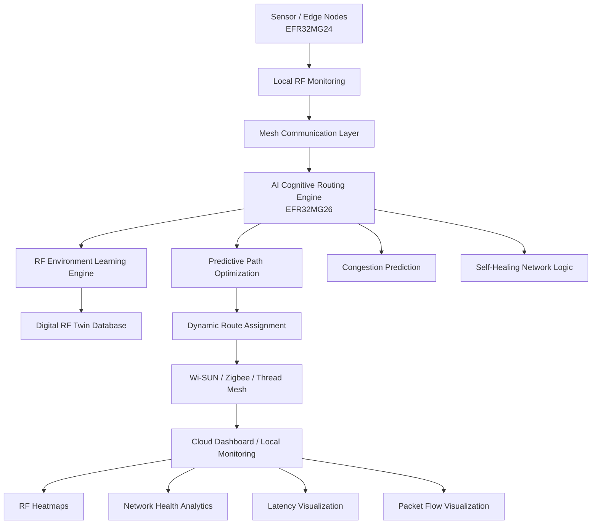
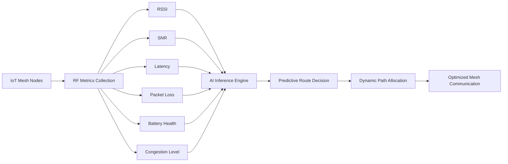
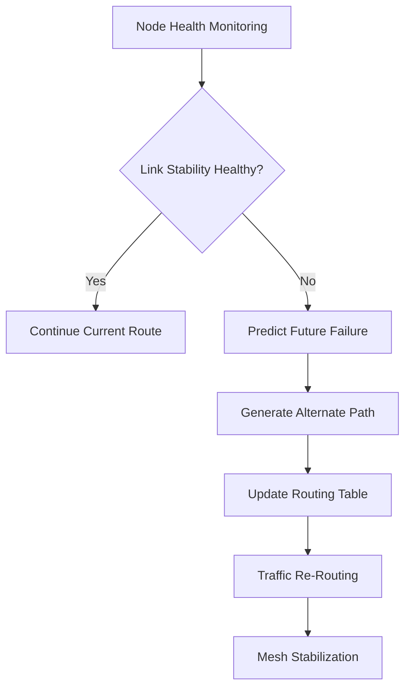
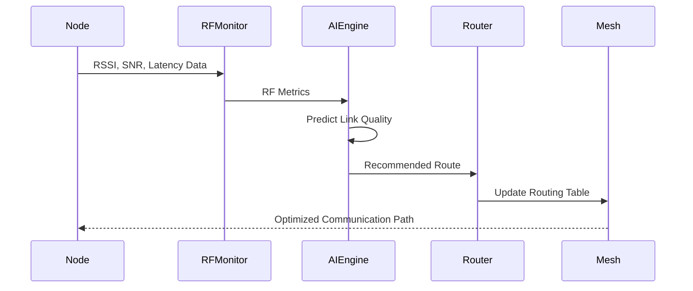
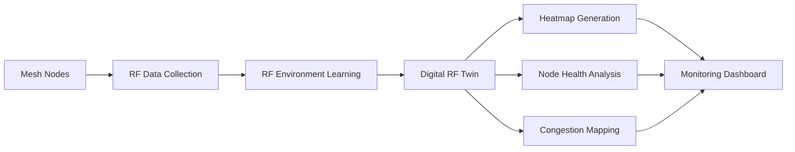

# Cognitive RF Environment Intelligence Platform (CREIP)

### *Self-Learning Predictive Mesh Intelligence for Next-Generation IoT Infrastructure*

---

# Project Overview

CREIP is an AI-powered wireless mesh networking platform built using Silicon Labs EFR32 devices to create smarter, more reliable, and self-adaptive IoT communication systems.

Traditional mesh networks often struggle in dynamic RF environments due to:

* interference,
* congestion,
* signal blockage,
* and unstable communication links.

CREIP introduces an edge-AI driven routing layer that continuously analyzes network conditions and predicts weak communication paths before failures occur.

The platform can:

* intelligently reroute traffic,
* optimize mesh communication,
* reduce packet loss and latency,
* and self-heal the network in real time.

CREIP also creates a Digital RF Twin to visualize network behavior, RF conditions, and node health across the infrastructure.

Unlike conventional routing systems, CREIP combines:

* predictive AI,
* RF-awareness,
* and autonomous optimization

to build a resilient and intelligent wireless ecosystem for future IoT deployments.

---

# Core Objectives

* Improve mesh reliability in difficult RF conditions
* Reduce communication latency and packet loss
* Enable predictive self-healing routing
* Minimize network downtime
* Enhance Silicon Labs IoT deployments with intelligent mesh optimization

---

# Target Users

* Industrial IoT operators
* Smart infrastructure providers
* Healthcare facilities
* Wireless system developers
* Silicon Labs ecosystem users

---

# Technical Architecture

## System Architecture

---

## Data Flow Architecture

---

## Self-Healing Workflow

---

## AI Routing Decision Process

---

## Digital RF Twin Workflow

---

# Technologies Used

## Wireless Technologies

* Wi-SUN Mesh Networking
* Sub-GHz RF Communication

---

## SDKs / Frameworks

* Gecko SDK (GSDK)
* Wi-SUN SDK
* TensorFlow Lite Micro (TinyML)

---

## Programming Languages

| Language   | Purpose                       |
| ---------- | ----------------------------- |
| C          | Embedded firmware             |
| C++        | AI-based routing logic        |
| Python     | AI model training & analytics |
| JavaScript | Dashboard visualization       |
| HTML/CSS   | Monitoring interface          |

---

## Development Tools

| Tool                | Purpose                          |
| ------------------- | -------------------------------- |
| Simplicity Studio 6 | Firmware development & debugging |
| Network Analyzer    | RF packet analysis               |
| Energy Profiler     | Power optimization               |
| VS Code             | Dashboard/backend development    |
| GitHub              | Version control                  |

---

# Hardware Components

## Silicon Labs Hardware

| Component            | Purpose                  |
| -------------------- | ------------------------ |
| EFR32MG24 SoC        | Mesh communication nodes |
| EFR32MG26 SoC        | AI routing controller    |
| Wireless Pro Kit     | Development & debugging  |
| BRD4198A Radio Board | Wi-SUN testing           |

---

## External Hardware

| Component                 | Purpose                      |
| ------------------------- | ---------------------------- |
| Raspberry Pi              | Dashboard hosting            |
| Environmental Sensors     | Network condition monitoring |
| OLED Display *(Optional)* | Local status display         |
| Lithium Battery Pack      | Portable node power          |

---

## Testing Tools

| Tool           | Purpose                 |
| -------------- | ----------------------- |
| Logic Analyzer | Communication debugging |
| Oscilloscope   | Signal testing          |

---

# Software Components / Dependencies

## Silicon Labs Dependencies

1. Gecko SDK Suite (GSDK) v4.x
2. Simplicity Studio v6
3. Wi-SUN SDK (Latest Stable Release)

---

## External Software Dependencies

| Software              | Purpose               |
| --------------------- | --------------------- |
| TensorFlow Lite Micro | Edge AI inference     |
| Flask                 | Dashboard backend     |
| MQTT                  | Node communication    |
| Grafana               | Network visualization |

---

# Licensing

This project uses the Apache License 2.0.

## Third-Party Licenses

| Component             | License    |
| --------------------- | ---------- |
| TensorFlow Lite Micro | Apache 2.0 |
| Grafana               | AGPLv3     |

---

# Maintainers / Contact

| Name            | Role                           | Contact                                                   | GitHub                           |
| --------------- | ------------------------------ | --------------------------------------------------------- | -------------------------------- |
| **Shubhi Garg** | Project Maintainer & Developer | [gargshubhi464@gmail.com](mailto:gargshubhi464@gmail.com) | https://github.com/shubhi-garg27 |

